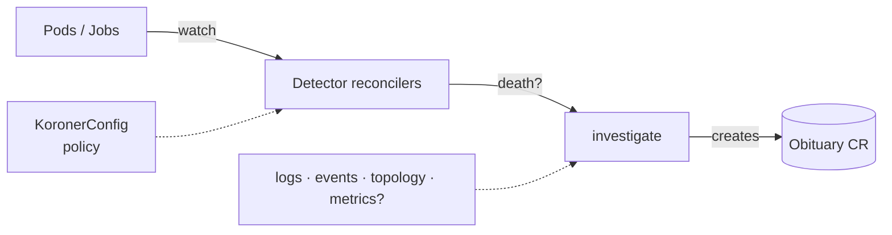

# Koroner

A Kubernetes operator that performs **post-mortems on dead workloads**. When a Pod or
Job dies, Koroner grabs the evidence before Kubernetes garbage-collects it - previous
container logs, exit codes, the event timeline, owner topology, and (optionally) Prometheus
metrics - runs a heuristic diagnosis, and writes an `Obituary` custom resource that
**outlives the corpse**.

No more racing `kubectl logs --previous` against the reaper. The cause of death is on record.


## How it works



- **Detectors** (`internal/controller`): watch core Pods and batch Jobs, recognise terminal
  failures (OOMKilled, CrashLoopBackOff, non-zero exit, restart-threshold breach, ImagePull
  failures, evictions, failed Jobs). Each death episode is deduplicated to exactly one
  Obituary via a deterministic name.
- **Forensics** (`internal/forensics`): pluggable evidence collectors plus a pure,
  unit-tested `Diagnose` function that maps evidence → cause of death + confidence.
- **CRDs** (`koroner.pez.sh/v1alpha1`): `Obituary` (the record) and `KoronerConfig`
  (runtime policy - what to watch, thresholds, log tail size, optional Prometheus).

The Obituary deliberately carries **no ownerReference to the deceased**, so it survives the
pod being reaped.

## Configuration

Apply a `KoronerConfig` named `default` in the operator's namespace for cluster-wide policy,
or one per namespace to override it. Sensible defaults apply when none exists. See
[`config/samples/koroner_v1alpha1_koronerconfig.yaml`](config/samples/koroner_v1alpha1_koronerconfig.yaml).

## Try it locally

```sh
kind create cluster
make install          # install CRDs
make run              # run the operator out-of-cluster

# in another shell - summon some deaths:
kubectl apply -f hack/deaths/

kubectl get obituaries
kubectl get obituary <name> -o yaml   # full evidence: logs, events, owners
```

Delete a dead pod and confirm its Obituary stays put.

## Roadmap (hooks already in place)

- LLM-written narrative post-mortem (`forensics.Narrator` interface; no-op today).
- Kubernetes `Event` / Slack / webhook delivery.
- Rollout-failure and eviction detectors (config flags exist).
- Obituary TTL reaper (`obituaryRetention` field exists).
