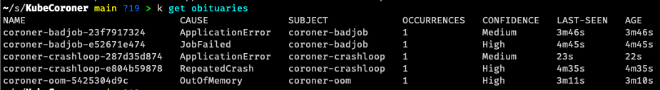
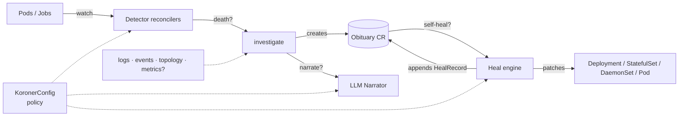

# Koroner

A Kubernetes operator that performs **post-mortems on dead workloads** - and, optionally,
**brings them back to life**. When a Pod or Job dies, Koroner grabs the evidence before
Kubernetes garbage-collects it (previous container logs, exit codes, the event timeline,
owner topology, optional Prometheus metrics), runs a heuristic diagnosis, writes an
`Obituary` custom resource that **outlives the corpse**, and - if self-heal is enabled -
attempts a remediation against the owning workload.

No more racing `kubectl logs --previous` against the reaper. The cause of death is on record.



## How it works



- **Detectors** (`internal/controller`): watch core Pods and batch Jobs, recognise terminal
  failures (OOMKilled, CrashLoopBackOff, non-zero exit, restart-threshold breach, ImagePull
  failures, evictions, failed Jobs). Each death episode is deduplicated to exactly one
  Obituary via a deterministic name.
- **Forensics** (`internal/forensics`): pluggable evidence collectors plus a pure,
  unit-tested `Diagnose` function that maps evidence → cause of death + confidence. An
  optional LLM `Narrator` writes a plain-English post-mortem (Anthropic or OpenAI).
- **Self-heal** (`internal/selfheal`): off by default. When enabled, gates a configured set
  of remediations (`DeletePod`, `RestartWorkload`, `BumpMemory`, `RollbackDeployment`) on
  occurrence count, confidence, per-namespace rate limit, and per-subject-kind capability.
  A rule decider maps cause-of-death → action; an optional LLM decider can override or
  fall through.
- **CRDs** (`koroner.pez.sh/v1alpha1`): `Obituary` (the record, including any
  `healAttempts` audit trail) and `KoronerConfig` (runtime policy).

The Obituary deliberately carries **no ownerReference to the deceased**, so it survives the
pod being reaped.

## Configuration

Apply a `KoronerConfig` named `default` in the operator's namespace for cluster-wide policy,
or one per namespace to override it. Sensible defaults apply when none exists. See
[`config/samples/koroner_v1alpha1_koronerconfig.yaml`](config/samples/koroner_v1alpha1_koronerconfig.yaml)
for the full schema including the `narrator` and `selfHeal` blocks.

### Self-heal

When `spec.selfHeal.enabled: true`, after each Obituary write Koroner consults the policy
and, if all gates pass, attempts a remediation. Every decision (Applied, DryRun, Skipped,
Failed) is appended to `status.healAttempts`.

Default gates (override per-namespace via `KoronerConfig`):

- `dryRun: true` - first opt-in is observable, not destructive
- `requireHighConfidence: true` - only act on High-confidence verdicts
- `minOccurrences: 3` - tolerate flakes
- `maxHealsPerHour: 5` - per-namespace rolling cap

Per-kind rule recommendations (the decider falls through to these unless an LLM decider
overrides):

| Subject     | OOM        | CrashLoop          | Probe   | AppErr    | ImagePull          | NodePressure |
| ----------- | ---------- | ------------------ | ------- | --------- | ------------------ | ------------ |
| Deployment  | BumpMemory | RollbackDeployment | Restart | DeletePod | RollbackDeployment | DeletePod    |
| StatefulSet | BumpMemory | Restart            | Restart | DeletePod | Restart            | DeletePod    |
| DaemonSet   | BumpMemory | Restart            | Restart | DeletePod | Restart            | DeletePod    |
| Pod (bare)  | -          | DeletePod          | DeletePod | DeletePod | -                | DeletePod    |
| Job, CronJob | -         | -                  | -       | -         | -                  | -            |

Causes left blank are intentionally not auto-actioned for that kind (no useful fix
available).

## Install with Helm

The chart is published as an OCI artifact on Docker Hub.

```sh
helm install koroner oci://registry-1.docker.io/rwejlgaard/koroner-chart \
  --namespace koroner-system \
  --create-namespace
```

Pin to a specific chart version with `--version 0.1.0`. List available versions:

```sh
helm show chart oci://registry-1.docker.io/rwejlgaard/koroner-chart
```

On first install with no `KoronerConfig` present, Koroner seeds a `default` one in
its own namespace with the built-in policy - edit it in place to tune behaviour:

```sh
kubectl -n koroner-system edit koronerconfig default
```

Common overrides via `--set` or `-f values.yaml`:

| Value                                 | Default              | Notes                                                  |
| ------------------------------------- | -------------------- | ------------------------------------------------------ |
| `image.tag`                           | chart `appVersion`   | Pin a specific operator build.                        |
| `replicas`                            | `1`                  | HA needs `leaderElection.enabled: true` (default on). |
| `crds.install`                        | `true`               | Set `false` if you manage CRDs out-of-band.           |
| `metrics.serviceMonitor.enabled`      | `false`              | Turns on Prometheus Operator scraping.                |
| `resources.*`                         | small request/limit  | Bump for busier clusters.                             |

Upgrade and uninstall:

```sh
helm upgrade koroner oci://registry-1.docker.io/rwejlgaard/koroner-chart -n koroner-system
helm uninstall koroner -n koroner-system   # CRDs are kept (helm.sh/resource-policy: keep)
```

## Try it locally

```sh
kind create cluster
make install          # install CRDs
make run              # run the operator out-of-cluster

# in another shell - summon some deaths:
kubectl apply -f hack/deaths/

kubectl get obituaries
kubectl get obituary <name> -o yaml   # full evidence: logs, events, owners, healAttempts
```

Delete a dead pod and confirm its Obituary stays put. To watch self-heal act, apply the
sample `KoronerConfig` with `selfHeal.enabled: true` and `dryRun: false`, then redeploy
`hack/deaths/oom-deployment.yaml` - after 3 OOMs Koroner bumps the memory limit on the
Deployment template and the new ReplicaSet rolls out at the larger size.

## Roadmap (hooks already in place)

- Kubernetes `Event` / Slack / webhook delivery.
- Rollout-failure and eviction detectors (config flags exist).
- Obituary TTL reaper (`obituaryRetention` field exists).
